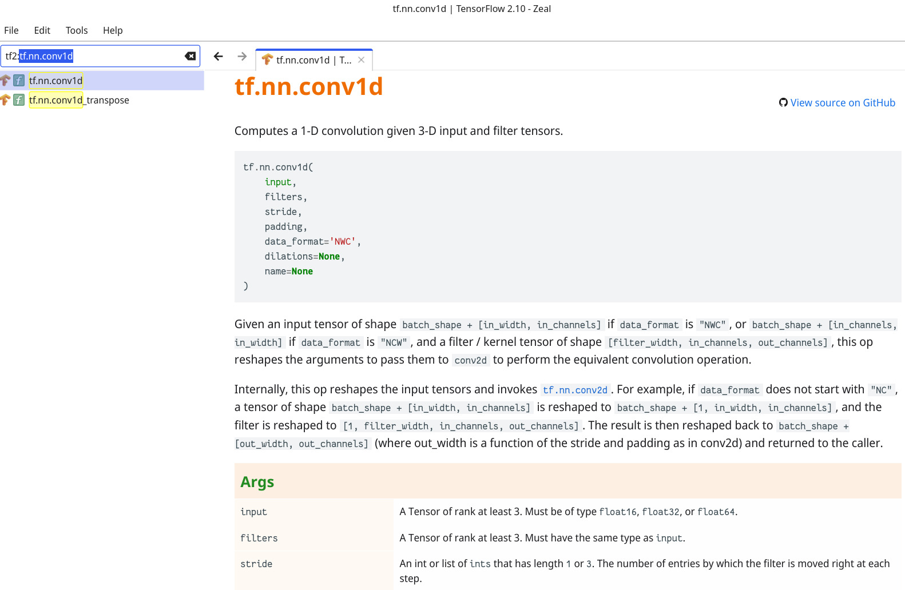

# dash-docset-tensorflow



View TensorFlow docs in the [dash](https://kapeli.com/dash)/[zeal](https://github.com/zealdocs/zeal) offline docset browser.

To use, you can add the following feeds in Dash/Zeal:
```
https://raw.githubusercontent.com/ppwwyyxx/dash-docset-tensorflow/master/TensorFlow2.xml
```
Or download the latest release [here](https://github.com/ppwwyyxx/dash-docset-tensorflow/releases).

## Steps to generate the docset (TF 2.10)
```bash
# Install dashing
go get -u github.com/technosophos/dashing
pip install --user tqdm beautifulsoup4 lxml pygments misaka
pip install --user -U git+https://github.com/tensorflow/docs
cd to [tensorflow repo]/tensorflow/tools/docs
python generate2.py --code_url_prefix "https://github.com/tensorflow/tensorflow/blob/v2.10.0/tensorflow/" --output_dir=/tmp/tf_generated_docs
cd to this repo
# Manually update version in `meta.json`
./generate-docset.sh /tmp/tf_generated_docs/
# "TensorFlow 2.docset" will now be generated under ./html
```

For TensorFlow 1 docs, see [./TF1](TF1).

Developer notes:
* Check class & method names at `tf.queue.QueueBase`
* Check Latex rendering at `tf.math.in_top_k`
* Check href at `tf.gather`
